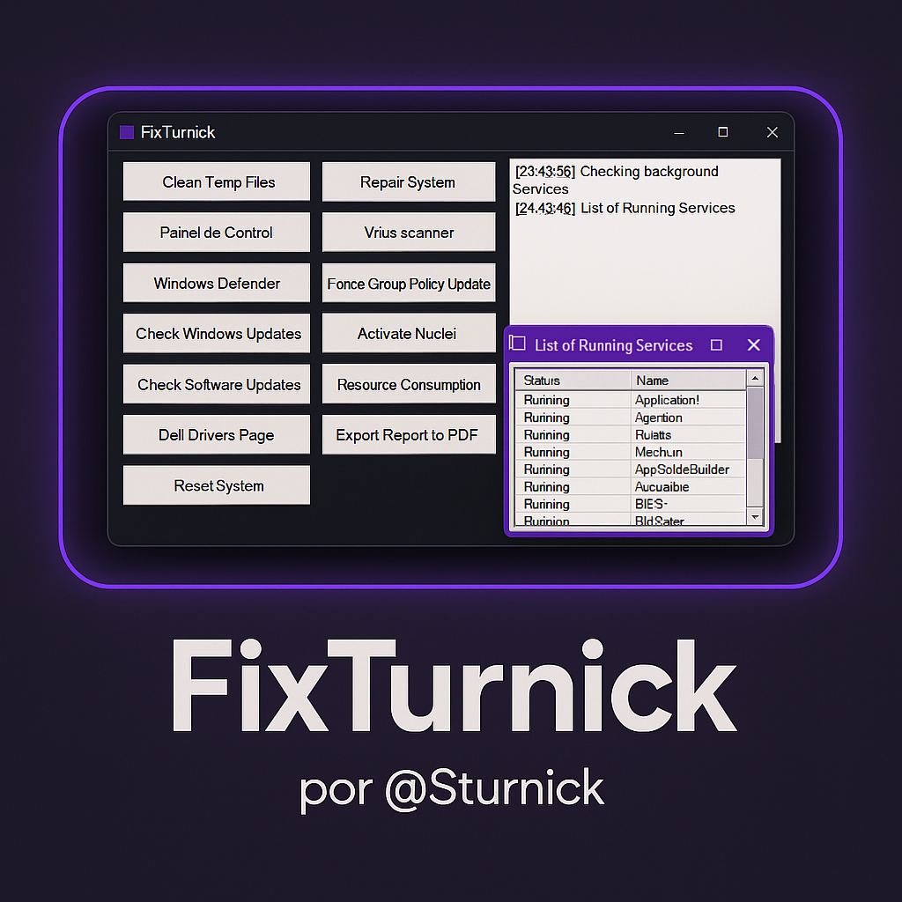

# 💜 FixTurnick 
> *Scripts suaves, lógica que brilha em roxo, sistemas imbatíveis.*

---

## ✔ Descrição

FixTurnick é uma poderosa ferramenta de reparo e manutenção para Windows, desenvolvida em PowerShell com uma interface gráfica moderna e intuitiva. Criada como um desafio pessoal em 1 mês, reúne 16 funcionalidades essenciais para resolver problemas comuns do sistema operacional de forma automatizada, rápida e eficaz.

---

## ⚙️ Funcionalidades

- ✅ Verificação do sistema.
- 🔄 Redefinição de rede e configurações.
- ⚡ Liberação de núcleos.
- 🧹 Limpeza de arquivos e registros.
- 📄 Geração de log em tempo real.
- 💥 Escaneamento de vírus.
- 🔁 Atualização de políticas.
- 🧰 Execução elevada com confirmação de reinício.
- 🎯 Modo automático: realiza tudo com 1 clique.
- ... E muito mais! (Total de 16 funcionalidades incríveis).

---

## 🎨 Interface

Interface gráfica amigável, com visual minimalista e fluidez, inspirada na estética roxa de performance e tecnologia.

> 💻 Desenvolvido com amor, lógica e café por [Sturnick](https://www.linkedin.com/in/angelys-geraldine-sanchez) 🧪✨

---

## 🚀 Como usar

1. Baixe o arquivo `FixTurnick.ps1`
2. Execute com privilégios de administrador
3. Utilize o menu para selecionar as opções desejadas
4. Acompanhe os logs e resultados em tempo real
5. Reinicie o PC ao final para aplicar as melhorias

---

## ⚠️ Aviso

> Este script é compatível com várias versões do Windows e foi cuidadosamente testado, mas sempre faça backup dos seus dados antes de aplicar modificações no sistema.

---

## 🖼️ Visão da Interface

  

---

## 📫 Contato

